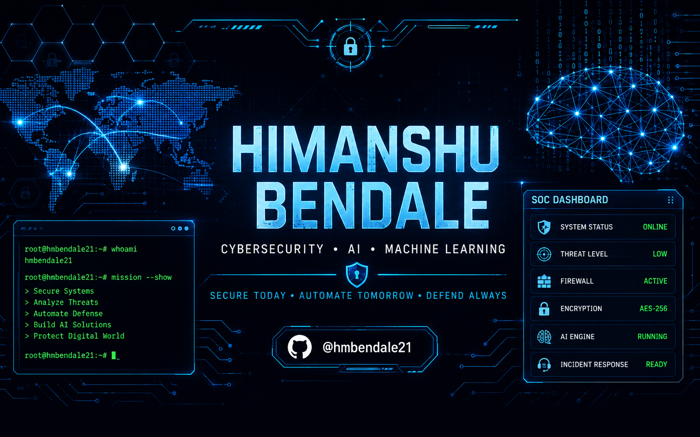

<p align="center">
  
</p>
<p align="center">


</p>

# 🛡 Cyber Operations Center

<table>
<tr>
<td width="50%">

## 🔐 Security Status

| Component | Status |
|-----------|--------|
| 🟢 System | **ONLINE** |
| 🛡 Firewall | **ACTIVE** |
| 🔒 Encryption | **AES-256** |
| 🚨 Threat Level | **LOW** |
| 🤖 AI Engine | **RUNNING** |
| 📡 SOC Monitor | **ACTIVE** |
| 💾 Backup | **HEALTHY** |
| 🌐 Network | **SECURE** |

</td>

<td width="50%">

## 👨‍💻 Operator

```bash
> whoami

Himanshu Bendale

> role

Cybersecurity Enthusiast
AI & ML Student

> current_project

SecureSphere

> status

ONLINE
```

</td>
</tr>
</table>

# 🎯 Current Mission

```text
✔ Building SecureSphere
✔ Learning AI Security
✔ Exploring Malware Analysis
✔ Practicing Linux & Networking
✔ Contributing to Open Source
✔ Handpractice on tryhackme
```

# ⚙️ Skills Matrix

| Domain | Technologies |
|--------|--------------|
| 💻 Languages | Python • Java • JavaScript |
| 🌐 Web | HTML • CSS • Bootstrap |
| 🤖 AI/ML | Machine Learning • TensorFlow • OpenCV |
| 🔐 Cybersecurity | Linux • Networking • OWASP |
| 🛠 Tools | Git • GitHub • VS Code |

# 🚨 Threat Dashboard

```text
██████████████████████  Firewall        ACTIVE

██████████████████████  Encryption      AES-256

██████████████████████  Threat Level    LOW

██████████████████████  AI Detection    RUNNING

██████████████████████  SecureSphere    DEVELOPMENT
```

# 👨‍💻 About Me

```yaml
Name: Himanshu Bendale
Location: Maharashtra, India 🇮🇳
Education: B.E. Artificial Intelligence & Data Science
Interests:
  - Cybersecurity
  - Artificial Intelligence
  - Machine Learning
Current Focus:
  - SecureSphere
  - AI Security
  - Linux
```

# 🚀 Featured Projects

| Project | Description | Status |
|---------|-------------|--------|
| 🛡 SecureSphere | Cybersecurity Dashboard | 🟢 Active |
| 🐆 Leopard Detection | AI Computer Vision | 🟢 Active |
| 🤖 CyberMind AI | AI Security Research | 🔵 Planning |

<p align="center">


</p>

<p align="center">


</p>

<p align="center">


</p>

<p align="center">


</p>

# 📡 Secure Communication Channels

<div align="center">

```text
╔══════════════════════════════════════════════════════════════╗
║                CYBER COMMUNICATION TERMINAL                 ║
╠══════════════════════════════════════════════════════════════╣
║ STATUS        : 🟢 ONLINE                                  ║
║ ENCRYPTION    : 🔐 TLS 1.3                                 ║
║ CONNECTION    : 🛰 SECURE                                  ║
║ RESPONSE TIME : ⚡ < 24 Hours                              ║
╚══════════════════════════════════════════════════════════════╝
```

<a href="mailto:himanshubendale88@gmail.com">

</a>

<a href="https://github.com/hmbendale21">

</a>

<a href="https://www.linkedin.com/in/himanshu-bendale-206973283/">

</a>

<a href="https://www.instagram.com/himanshu_bendale21/">

</a>

</div>

---

## 💬 Terminal Access

```bash
$ ping Himanshu

PING successful...

Name        : Himanshu Bendale
Role        : AI & Cybersecurity Engineer
GitHub      : github.com/hmbendale21
LinkedIn    : linkedin.com/in/himanshu-bendale-206973283
Instagram   : @himanshu_bendale21
Email       : himanshubendale88@gmail.com

Status      : ONLINE 🟢
Availability: Open for Collaboration
Response    : < 24 Hours
```

```python
while alive:

    learn()

    build()

    secure()

    repeat()
```
